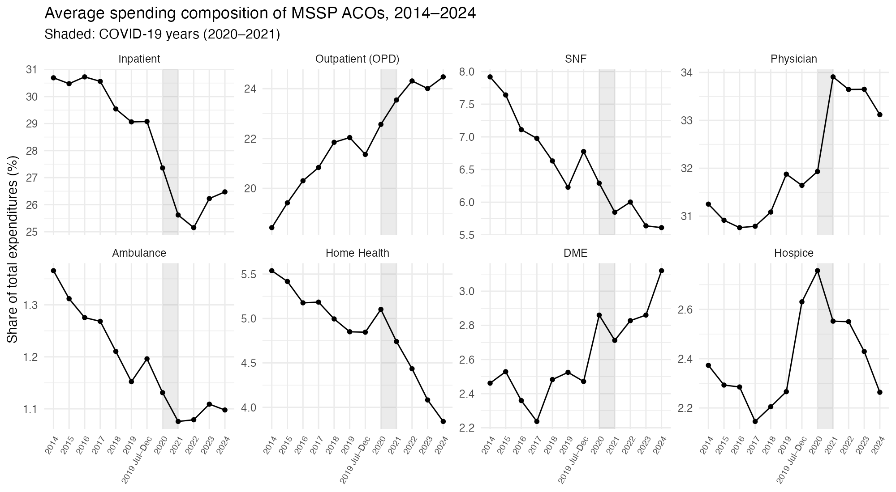
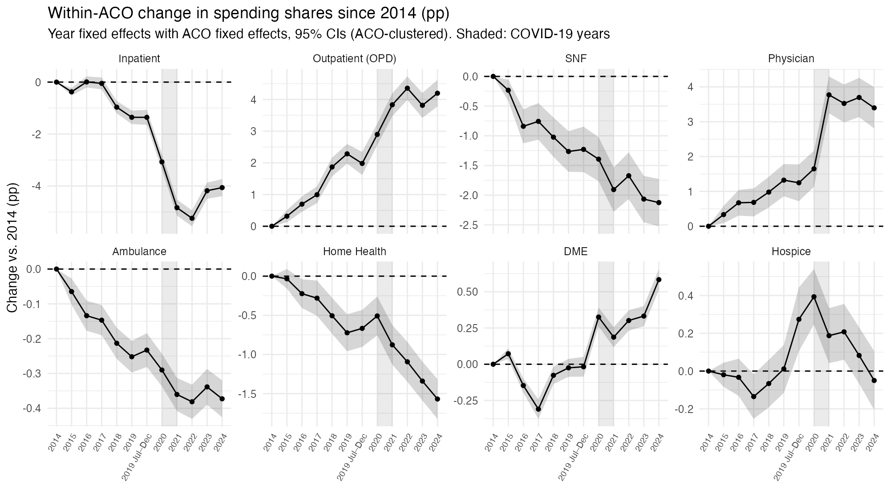
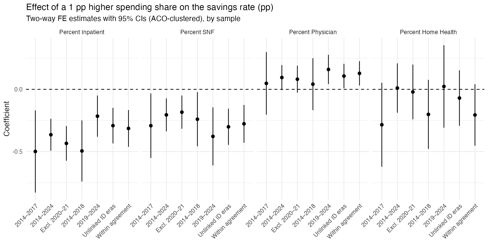

# Medicare ACO Spending Patterns – Replication (2014–2017) & Extension (2014–2024)

This project replicates and extends findings from **Muhlestein et al. (2018)**, *Medicare Accountable Care Spending Patterns: Shifting Expenditures Associated With Savings*, AJAC 6(1):11–19.

Using updated **2014–2017 MSSP ACO Public Use Files**, I recreate spending-share metrics and estimate fixed-effects models to test which expenditure shifts are associated with shared savings. I then extend the analysis through **performance year 2024**.

---

## Key Results (Replication, 2014–2017)

- **Lower inpatient and SNF spending shares** are consistently associated with higher savings.
- **Higher physician spending share** is modestly positive but less consistent.
- Results closely match the original study despite using later data.
- Findings hold under:
  - ACO & year fixed effects  
  - ACO‐clustered SEs  
  - Reduced models (multicollinearity)  
  - Fixed-effects logistic regression (inpatient share only; the SNF logit coefficient is not significant for 2014–2017)

**Bottom line:** ACOs that save money shift dollars **away from inpatient/SNF** toward **physician-directed outpatient care**.

---

## Extension to 2024

`analysis/ACO_Extension.Rmd` re-estimates the models on every MSSP performance year from 2014 through 2024 (about 5,100 ACO-years) to test whether the pattern survived the 2019 *Pathways to Success* redesign and COVID-19.



- **Spending kept shifting.** From 2014 to 2024 the average inpatient share fell from 30.7% to 26.5% and SNF from 7.9% to 5.6%, while outpatient rose from 18.4% to 24.5% and physician from 31.3% to 33.1%.
- **The shift happens within ACOs, not just through turnover.** Year fixed-effects models with ACO fixed effects (the original study's first model) show the same ACOs cut their inpatient share by 4.1 pp and SNF by 2.1 pp from 2014 to 2024, while outpatient rose 4.2 pp and physician 3.4 pp (all p < 0.001). Inpatient fell most sharply in 2020–2022 and has partly rebounded.
- **ACOs save far more often.** 54% generated savings in 2014 vs. 89% in 2024 (median savings rate 0.3% → 4.1%).
- **The core finding holds.** Over 2014–2024, a 1 pp higher inpatient share is associated with a 0.29 pp lower savings rate, and a 1 pp higher SNF share with a 0.30 pp lower rate (both p < 0.001). Both stay negative and significant when dropping the COVID years, splitting before/after 2019, and linking ACO IDs across eras.
- **Physician share turns significant.** With the larger sample it is positive (+0.11 pp, p < 0.05), and strongest after 2019 (+0.16 pp, p < 0.01).
- **Home health does not hold up.** The replication's negative home-health association is near zero and insignificant over 2014–2024.
- **FE logit agrees.** Higher inpatient and SNF shares both significantly lower the odds of achieving savings.





All extension models use ACO and performance-period fixed effects with ACO-clustered SEs. Full tables are in `outputs/extension_main_results.html`, `outputs/extension_robustness.html`, and `outputs/extension_spending_trends.html`; the knitted report is `outputs/ACO_Extension.html`.

---

## Repository Structure

```
analysis/
  ACO_Final.rmd       # full reproducible analysis (replication, 2014–2017)
  One_Pager.Rmd       # code for 1-page summary
  ACO_Extension.Rmd   # extension to 2014–2024

outputs/
  Medicare ACO Spending Patterns Replication Full Code Readout.pdf   # knitted full analysis
  One_Pager.pdf       # polished results summary
  ACO_Extension.html  # knitted extension report
  extension_main_results.html, extension_robustness.html,
  extension_spending_trends.html                           # extension tables
  figures/            # extension figures

data/
  2014.csv – 2024.csv     # raw MSSP ACO Public Use Files (2019A.csv: Jul–Dec 2019)
  aco_data.csv            # cleaned MSSP panel data, 2014–2017
  aco_data.rds            # cleaned MSSP panel data, 2014–2017 (R format)
  aco_panel_2014_2024.csv # harmonized panel used by the extension
```

---

## Reproduce the Analysis

1. Open `analysis/ACO_Final.rmd` in RStudio.  
2. Install required packages: tidyverse, janitor, plm, lmtest, sandwich, fixest, broom, modelsummary, flextable.  
3. Knit the file to regenerate all models and figures.  
4. Knit `One_Pager.Rmd` to recreate the summary PDF.
5. Knit `ACO_Extension.Rmd` to rerun the 2014–2024 extension; tables and figures are written to `outputs/`.

---

## Data Source

CMS, [Medicare Shared Savings Program Performance Year Financial and Quality Results](https://data.cms.gov/medicare-shared-savings-program/performance-year-financial-and-quality-results) public use files. Notes:

- 2019 has two files: `2019.csv` (full-year and January–June ACOs) and `2019A.csv` (ACOs that began new agreements on July 1, 2019).
- `2024.csv` is CMS's July 2026 revision.
- The 2014–2017 files identify ACOs with a masked `ACO_Num`; 2018+ use the CMS `ACO_ID`. There is no official crosswalk, so the extension treats them as separate units and links them by ACO name as a robustness check.

---

## Original Study Citation

Muhlestein DB, Morrison SQ, Saunders RS, Bleser WK, McClellan MB, Winfield LD.  
*Medicare Accountable Care Spending Patterns: Shifting Expenditures Associated With Savings.*  
**American Journal of Accountable Care.** 2018;6(1):11–19.

---

## License

MIT License. See `LICENSE` for details.
